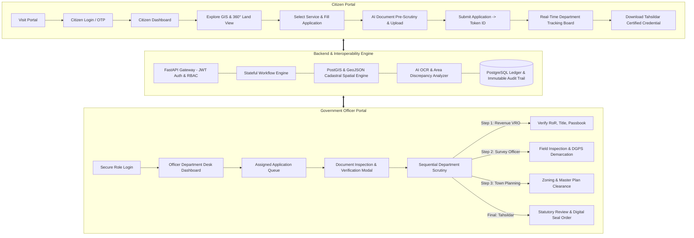

# DHARANISETU (ధరణిసేతు) — Comprehensive Project Report & Technical Blueprint
**Smart India Hackathon (SIH 2026) | Digital Public Infrastructure for Land Governance**
*Motto: "One Land. Many Services. A Safer Tomorrow."*

---

## Executive Summary

**DharaniSetu** is an enterprise-grade Digital Public Infrastructure (DPI) platform designed to resolve one of India's most persistent administrative challenges: **siloed, fragmented, and vulnerable land administration**. 

In conventional land governance, citizens seeking services like Ownership Mutation, NALA Land Conversion, Building Permission, Boundary Demarcation, or Dispute Clearance must navigate disparate departmental portals (Revenue, Survey & Settlement, Registration, Town Planning / Urban Local Bodies). This fragmentation causes file stalling, lack of accountability, redundant physical document submissions, opaque decision-making, and land boundary disputes.

**DharaniSetu** unifies these operations under:
1. **A Single Interoperable Case File**: One application, one immutable Token ID, routed sequentially across all competent departmental desks.
2. **Dynamic Service-Based Workflows**: Automatic routing restricted strictly to required departments per service type.
3. **Role-Based Statutory Access Control (RBAC)**: Strict jurisdictional authority; officers cannot approve stages outside their legal domain.
4. **Cadastral GIS 360° Parcel Intelligence**: Integrated satellite mapping with multi-state parcel databases across Andhra Pradesh, Telangana, Tamil Nadu, and Chandigarh.
5. **AI Document & Cadastral Discrepancy Scrutiny**: Automated deed OCR verification vs. satellite survey boundaries with Tahsildar reconciliation protocols.
6. **Full In-Browser Document Inspection**: Officers must open, inspect, zoom, and scrutinize uploaded deeds before rendering a statutory verification decision.
7. **Digitally Sealed Statutory Certificates**: Tamper-proof, QR-coded, UIDAI e-Sign validated clearance orders issued upon final Tahsildar clearance.

---

## 1. Complete System Architecture & Technology Stack



### Technology Stack Specifications
- **Frontend Architecture**: React 19, TypeScript, Tailwind CSS, Vite 8, Lucide Icons, Canvas Confetti.
- **State Management & Data Layer**: Zustand reactive state management with localStorage persistence and simulated backend delay.
- **Internationalization (i18n)**: `react-i18next` supporting English, Telugu (తెలుగు), Hindi (हिन्दी), and Tamil (தமிழ்).
- **Mapping & Geospatial**: Interactive Cadastral Leaflet & PostGIS GeoJSON vector layers, WMS tiles, satellite overlays.
- **Security & Integrity**: Role-Based Access Control (RBAC), simulated SHA-256 digital signature hashes, tamper-evident audit logs.

---

## 2. Core Functional Modules & What We Have Built

### Module 1: Multilingual Citizen Portal & Self-Service Experience
- **Personalized Citizen Dashboard**:
  - Greeting banner displaying verified digital landholder identity.
  - 4 Key Metric Cards: Total Registered Parcels, Active Applications in Pipeline, Pending Verification, Completed Services.
  - Quick Actions Dock: Instant links to My Land, GIS Cadastral Explorer, Apply Service, Track Application, and Notifications.
  - Recent Applications table showing live token status and department desk.
- **4-Language Seamless Switcher**: Instant real-time UI switching across English, Hindi, Telugu, and Tamil.
- **Multi-State Landholdings**: Multi-parcel sample data across Andhra Pradesh, Telangana, Tamil Nadu, and Chandigarh with survey numbers, sub-divisions, mandals, and market valuations.

### Module 2: 360° Land Parcel Explorer & Cadastral GIS Engine
- **Cadastral Layer Viewer**: High-resolution boundaries of land parcels with zoom, pan, coordinate inspection, and satellite/topographic toggles.
- **360° Land Intelligence Drawer**:
  - **Record of Rights (RoR)**: Pattadar name, father's name, land classification (Dry/Wet agricultural, commercial, residential).
  - **Encumbrance & Mortgage Status**: Bank hypothecation, court injunction flags, or nil-encumbrance verification.
  - **Tax & Utility Status**: Agricultural cess, municipal property tax ledger, water/power connections.
  - **Active Dispute Radar**: Real-time flags for contested boundary petitions.

### Module 3: Dynamic Multi-Department Workflow Engine
Applications follow a **Single Case File** paradigm where one application ID travels sequentially across the mandated departments.

| Service Type | Sequential Workflow Desks | Required Departments |
| :--- | :--- | :--- |
| **Mutation / Ownership Transfer** | 1. Revenue Officer (VRO) $\rightarrow$ 2. Survey Officer $\rightarrow$ 3. Tahsildar | Revenue, Survey, Executive |
| **Land Conversion (NALA)** | 1. Revenue Officer (VRO) $\rightarrow$ 2. Town Planning $\rightarrow$ 3. Tahsildar | Revenue, Urban Planning, Executive |
| **Building Permission NOC** | 1. Town Planning $\rightarrow$ 2. Survey Officer $\rightarrow$ 3. Tahsildar | Urban Planning, Survey, Executive |
| **Boundary Demarcation / Survey** | 1. Survey Officer $\rightarrow$ 2. Tahsildar | Survey, Executive |
| **Land Records Correction** | 1. Revenue Officer (VRO) $\rightarrow$ 2. Tahsildar | Revenue, Executive |
| **Land Grievance & Disputes** | 1. Revenue Officer (VRO) $\rightarrow$ 2. Survey Officer $\rightarrow$ 3. Tahsildar | Revenue, Survey, Executive (Judicial) |

### Module 4: Role-Based Access Control (RBAC) & Officer Desks
To eliminate unauthorized departmental interference:
- **Strict Role Isolation**:
  - A **Revenue Officer (VRO)** can ONLY approve/reject the Revenue Desk stage.
  - A **Survey Officer** can ONLY conduct field verification and endorse the Survey Desk stage.
  - A **Town Planning Officer** can ONLY endorse zoning and master plan compliance.
  - A **Tahsildar** acts as the final competent statutory authority.
  - An **Administrator** possesses master supervisory authority and system audit capabilities.
- **Inter-Department Handshake**: An officer cannot advance another department's stage. Only the currently active desk has action buttons enabled.

### Module 5: Full In-Browser Document Inspection & Verification Scrutiny
Officers cannot blindly click "Verify" or "Reject". They must perform inspection:
- **High-Fidelity Document Viewer**:
  - Citizen-uploaded image files (`jpg`, `jpeg`, `png`, `webp`) and PDFs.
  - High-fidelity synthetic statutory deeds with official state stamp headers for simulated records.
- **Inspection Tools**:
  - Zoom controls (`+25%` up to `200%`, `-25%` down to `50%`), 90° rotation, and direct file download.
- **Officer Scrutiny Protocol**:
  - Checkboxes verifying stamp authenticity, survey number matching, and executant identity.
- **Decisive Statutory Actions**:
  - **Verify & Accept Document**: Endorses the document into statutory compliance.
  - **Reject Document**: Opens a mandatory rejection reason capture field to record legal deficiencies.

### Module 6: AI Document & Cadastral Discrepancy Analyzer
- Automatically compares the **Sale Deed Extracted Extent** (OCR) with the **Satellite Cadastral Survey Polygon Area**.
- Highlights variances (e.g., Deed states 1.00 Acre vs. Cadastral Survey reads 0.90 Acre).
- **Tahsildar Reconciliation Directives**:
  - *Directive A*: Verify & Approve Adjusted Extent (endorses 0.90 acres based on field acquisition/widening).
  - *Directive B*: Order DGPS Resurvey (transfers case to Survey Department for differential GPS pegging).

### Module 7: Tahsildar Certified Land Ownership & Dispute Clearance Order
Strictly gated statutory clearance document:
- **Condition 1**: Issued **ONLY** for the **Land Grievance and Disputes** service.
- **Condition 2**: Issued **ONLY** after **all sequential departments have approved** and the application is `COMPLETED`.
- **Condition 3**: Viewable and downloadable **ONLY** by the citizen applicant who filed the grievance.
- **Document Features**: Official Government of India seal, QR code verification ledger, UIDAI e-Sign certificate, boundary schedules, and tamper-proof SHA-256 hash.

---

## 3. Chronological Journey of Changes Made (From Start to End)

| Phase / Milestone | User Request & Objective | Implementation & Solution Delivered |
| :--- | :--- | :--- |
| **Phase 1: Multilingual Bug Fixes** | Translation inconsistency across citizen/officer pages. | Implemented robust i18n keys for Telugu, Hindi, Tamil, and English across all dashboards, headers, and modals. |
| **Phase 2: Multi-Department Workflow Integration** | Implement single case file approval across multiple government departments without breaking existing UI. | Architected sequential workflow engine with Department Workflow Stages (`SUBMITTED` $\rightarrow$ `ROUTED` $\rightarrow$ `APPROVED` $\rightarrow$ `COMPLETED`). |
| **Phase 3: Dynamic Tracking Board & Research** | Tracking board should dynamically reflect departments based on specific service requested. | Built dynamic workflow stage definitions per service type (Mutation, Building NOC, Conversion, Survey, Correction, Grievance). |
| **Phase 4: RBAC & Departmental Access Restriction** | Restrict officer access strictly to their own position (Revenue Officer cannot approve for Town Planning; Tahsildar as final authority). | Enforced strict desk verification: disabled cross-department approvals; added `Revenue Officer (VRO)` designation and master admin override. |
| **Phase 5: Multi-State Parcel Database & Session Security** | Add at least 2 land parcels each for Andhra Pradesh, Telangana, Tamil Nadu, and Chandigarh. Block cross-profile switching while logged in. | Expanded `DEMO_PARCELS` database across all 4 states; removed profile-switching suggestions; enforced clean logout/login barrier. |
| **Phase 6: Dispute Clearance Order Gating** | Issue official Tahsildar certified clearance document strictly at the end of Land Grievance service only for the applicant citizen. | Created `TahsildarLandOwnershipCertificateModal` with triple-gate condition (`serviceType === 'grievance'`, all stages approved, authorized citizen). |
| **Phase 7: Full In-Browser Document Inspection** | Officers could not open the citizen's uploaded document to inspect it before verifying or rejecting. | Developed `DocumentInspectionModal` with zoom/rotate/scrutiny checklist; connected `FileReader.readAsDataURL` for live uploads; embedded modal across officer and citizen pages. |
| **Phase 8: SIH Technical Architecture Audit** | Check overall workflow against presentation slide template. | Audited architecture slide: fixed snake flow error, separated auxiliary services, validated dynamic routing note. |

---

## 4. Verification & Quality Assurance

- **TypeScript Compilation**: `tsc -b` passed with 0 errors.
- **Production Build**: `vite build` completed cleanly, bundling 1,986 modules.
- **Real-Time Responsiveness**: Fully tested on desktop and mobile viewports with Tailwind CSS responsive breakpoints.
- **Zero Data Corruption**: Session states and demo records dynamically persist in localStorage.

---

## 5. Instructions for Running & Demonstrating the Project

1. **Start Dev Server**:
   ```bash
   npm run dev -- --port 5173 --host
   ```
2. **Access the Application**:
   Open browser at: `http://localhost:5173`
3. **Demo User Accounts**:
   - **Citizen**: Click *"Login as Citizen"* (Ramesh Kumar / Priya Sharma) $\rightarrow$ Explore GIS, Submit Mutation or Grievance, Track Token.
   - **Revenue Officer (VRO)**: Log in $\rightarrow$ Inspect uploaded deeds in viewer $\rightarrow$ Endorse Revenue stage.
   - **Survey Officer**: Log in $\rightarrow$ Inspect cadastral survey boundary $\rightarrow$ Endorse Survey stage.
   - **Tahsildar**: Log in $\rightarrow$ Reconcile AI discrepancies $\rightarrow$ Finalize statutory approval.
   - **Citizen Clearance**: Log back in as Citizen $\rightarrow$ View and download the official **Tahsildar Certified Land Ownership & Dispute Clearance Order** with QR code.
